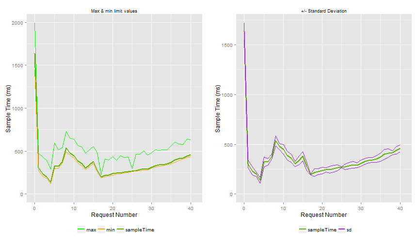

--- .class #id .background "#006600" 
## Synthesis Test on JT1 2014

Luis Razo

2015-02-23

--- .class #id .background "#006600" 

## Synopsis

The present analysis consider the most relevant test that have been performed over the JT1 system evaluating the performance, we consider the date of the test and the evolution of the results on the time.

--- .class #id 

## Base scenario


The scenario is composed by 40 setCstic. 


Data acquisition


+ Using JMeter

- Systems:              JT1
    
- Model(alias):         KB_GCR_NW_CB

- Version:              141023.0

- AutoUnset:            true

- defaultValues:        true


--- .class #id 

## Base scenario

+ setCstic using the following parameters at each request:

<!-- html table generated in R 3.1.2 by xtable 1.7-4 package -->
<!-- Mon Feb 23 01:03:34 2015 -->
<table border=1>
<tr> <th>  </th> <th> Bompath </th> <th> Characteristic </th> <th> Value </th>  </tr>
  <tr> <td align="right"> 1 </td> <td> 0000 </td> <td> TARATED_CURRENT </td> <td> 250_A </td> </tr>
  <tr> <td align="right"> 2 </td> <td> 00000010 </td> <td> TABREAKING_CAPACITY </td> <td> 65_KA_220_41_AC_IEC_60_00 </td> </tr>
  <tr> <td align="right"> 3 </td> <td> 0000 </td> <td> T_POLES_DESCRIPTION </td> <td> 3P </td> </tr>
  <tr> <td align="right"> 4 </td> <td> 00000020 </td> <td> T_TRIP_UNIT_NAME </td> <td> MICROLOGIC_2.0 </td> </tr>
  <tr> <td align="right"> 5 </td> <td> 0000 </td> <td> TC_MOUNTING_MODE </td> <td> FIXED </td> </tr>
  <tr> <td align="right"> 6 </td> <td> 0000 </td> <td> TC_MOUNTING_MODE_3 </td> <td> FRONT_CONNECTION </td> </tr>
  <tr> <td align="right"> 7 </td> <td> 0000 </td> <td> TC_MOUNTING_MODE_4 </td> <td> FRONT_CONNECTION </td> </tr>
  <tr> <td align="right"> 8 </td> <td> 0000 </td> <td> YN_COMMUNICATION </td> <td> YES </td> </tr>
  <tr> <td align="right"> 9 </td> <td> 0000 </td> <td> YN_CONTROL_AND_REMOTE_ON_OFF </td> <td> YES </td> </tr>
  <tr> <td align="right"> 10 </td> <td> 0000 </td> <td> YN_DOOR_FRAME_AND_ACCESSORIES </td> <td> YES </td> </tr>
  <tr> <td align="right"> 11 </td> <td> 0000 </td> <td> YN_INDICATION </td> <td> NO </td> </tr>
  <tr> <td align="right"> 12 </td> <td> 0000 </td> <td> YN_LOCKING </td> <td> YES </td> </tr>
   </table>

--- .class #id 

## Base scenario

<!-- html table generated in R 3.1.1 by xtable 1.7-4 package -->
<!-- Fri Jan 30 10:11:42 2015 -->
<table border=1>
<tr> <th>  </th> <th> Bompath </th> <th> Characteristic </th> <th> Value </th>  </tr>
  <tr> <td align="right"> 13 </td> <td> 00000020 </td> <td> YN_LONG_TIME_RATING_PLUG </td> <td> YES </td> </tr>
  <tr> <td align="right"> 14 </td> <td> 000000200020 </td> <td> T_LONG_TIME_PICK_UP_ADJ_RANGE </td> <td> 0.4..0.8_X_IR </td> </tr>
  <tr> <td align="right"> 15 </td> <td> 00000060 </td> <td> T_DEVICE_SHORT_NAME </td> <td> MODBUS_COM </td> </tr>
  <tr> <td align="right"> 16 </td> <td> 00000060 </td> <td> YN_FDM121 </td> <td> YES </td> </tr>
  <tr> <td align="right"> 17 </td> <td> 00000060 </td> <td> YN_FDM_MOUNTING_ACCESSORY </td> <td> YES </td> </tr>
  <tr> <td align="right"> 18 </td> <td> 000000600030 </td> <td> T_DEVICE_SHORT_NAME </td> <td> CORD_L_=_0.35_M </td> </tr>
  <tr> <td align="right"> 19 </td> <td> 00000070 </td> <td> YN_MCH_GEAR_MOTOR </td> <td> YES </td> </tr>
  <tr> <td align="right"> 20 </td> <td> 000000700010 </td> <td> TACONTROL_CIRCUIT_VOLTAGE </td> <td> 24..30_V_DC_00 </td> </tr>
  <tr> <td align="right"> 21 </td> <td> 00000070 </td> <td> YN_XF_CLOSING_RELEASE </td> <td> YES </td> </tr>
  <tr> <td align="right"> 22 </td> <td> 000000700020 </td> <td> TACONTROL_CIRCUIT_VOLTAGE </td> <td> 12_V_DC_00 </td> </tr>
  <tr> <td align="right"> 23 </td> <td> 00000070 </td> <td> YN_REMOTE_RESET_AFT_FAULT_TRIP </td> <td> YES </td> </tr>
  <tr> <td align="right"> 24 </td> <td> 000000700050 </td> <td> TACONTROL_CIRCUIT_VOLTAGE </td> <td> 110..130_V </td> </tr>
  <tr> <td align="right"> 25 </td> <td> 00000070 </td> <td> YN_SHUNT_TRIP </td> <td> YES </td> </tr>
   </table>

--- .class #id 

## Base scenario

<!-- html table generated in R 3.1.1 by xtable 1.7-4 package -->
<!-- Fri Jan 30 10:11:42 2015 -->
<table border=1>
<tr> <th>  </th> <th> Bompath </th> <th> Characteristic </th> <th> Value </th>  </tr>
  <tr> <td align="right"> 25 </td> <td> 00000070 </td> <td> YN_SHUNT_TRIP </td> <td> YES </td> </tr>
  <tr> <td align="right"> 26 </td> <td> 000000700030 </td> <td> TACONTROL_CIRCUIT_VOLTAGE </td> <td> 12_V_DC_00 </td> </tr>
  <tr> <td align="right"> 27 </td> <td> 00000070 </td> <td> YN_2ND_SHUNT_TRIP </td> <td> YES </td> </tr>
  <tr> <td align="right"> 28 </td> <td> 000000700070 </td> <td> TACONTROL_CIRCUIT_VOLTAGE </td> <td> 12_V_DC_00 </td> </tr>
  <tr> <td align="right"> 29 </td> <td> 00000070 </td> <td> TC_READY_TO_CLOSE </td> <td> NOT_APPLICABLE </td> </tr>
  <tr> <td align="right"> 30 </td> <td> 00000150 </td> <td> YN_DOOR_FRAME </td> <td> YES </td> </tr>
  <tr> <td align="right"> 31 </td> <td> 00000150 </td> <td> YN_BLANKING_PLATE </td> <td> YES </td> </tr>
  <tr> <td align="right"> 32 </td> <td> 00000090 </td> <td> YN_DEVICE_LOCKING </td> <td> YES </td> </tr>
  <tr> <td align="right"> 33 </td> <td> 000000900030 </td> <td> YN_DEVICE_LOCKING </td> <td> YES </td> </tr>
  <tr> <td align="right"> 34 </td> <td> 000000900030 </td> <td> T_DEVICE_SHORT_NAME </td> <td> PADLOCKING_DEVICE </td> </tr>
  <tr> <td align="right"> 35 </td> <td> 000000900030 </td> <td> YN_PADLOCKING </td> <td> YES </td> </tr>
  <tr> <td align="right"> 36 </td> <td> 000000900030 </td> <td> YN_SWITCHBOARD_DOOR_INTERLOCK </td> <td> YES </td> </tr>
  <tr> <td align="right"> 37 </td> <td> 0000 </td> <td> YN_MANUAL_FRONT_CONNECTION_KIT </td> <td> YES </td> </tr>
   </table>

--- .class #id 

## Base scenario

<!-- html table generated in R 3.1.1 by xtable 1.7-4 package -->
<!-- Fri Jan 30 10:11:42 2015 -->
<table border=1>
<tr> <th>  </th> <th> Bompath </th> <th> Characteristic </th> <th> Value </th>  </tr>
  <tr> <td align="right"> 37 </td> <td> 0000 </td> <td> YN_MANUAL_FRONT_CONNECTION_KIT </td> <td> YES </td> </tr>
  <tr> <td align="right"> 38 </td> <td> 0000 </td> <td> YN_OPERATION_COUNTER </td> <td> YES </td> </tr>
  <tr> <td align="right"> 39 </td> <td> 0000 </td> <td> YN_FIXING_BRACKET </td> <td> YES </td> </tr>
  <tr> <td align="right"> 40 </td> <td> 0000 </td> <td> YN_GROUNDING_KIT </td> <td> YES </td> </tr>
   </table>


--- .class #id 

## Base scenario

+ deleteConfig at the end.


--- .class #id 

## Results all tests


 

--- .class #id 

## Results all tests

 

--- .class #id 

## Results all tests

 

--- .class #id 

## Results all tests

 


--- .class #id 

## Results all tests

 

--- .class #id 

## Results all tests

 

--- .class #id 

## Results all tests

 

--- .class #id 

## Results all tests

 


--- .class #id 


## Test case 2014-11-24 13:39:23 

Users: 1

 Model: KB_GCR_NW_CB

 Version: 140825.0

  defaultValues: 20

 autounset: true

 setDefaults: true

 ramup: 30

 times: 30

 Errors: 0

 Clicks: 41

The test started at 2014-11-24 13:39:23 and finished at 2014-11-24 13:41:58

Therefore the total duration was around 3 minutes.

The number of configurations by hour was around 23 


--- .class #id 


## Test case 2014-11-24 13:39:23 


--- .class #id 


## Test case 2014-11-24 13:39:23 

```
## Loading required package: grid
```

  

--- .class #id 


## Test case 2014-11-24 13:42:06 

Users: 10

 Model: KB_GCR_NW_CB

 Version: 140825.0

  defaultValues: 20

 autounset: true

 setDefaults: true

 ramup: 300

 times: 300

 Errors: 0

 Clicks: 410

The test started at 2014-11-24 13:42:06 and finished at 2014-11-24 13:49:17

Therefore the total duration was around 7 minutes.

The number of configurations by hour was around 84 


--- .class #id 


## Test case 2014-11-24 13:42:06 

 

--- .class #id 


## Test case 2014-11-24 13:42:06 

 

--- .class #id 


## Test case 2014-11-25 10:19:21 

Users: 30

 Model: KB_GCR_NW_CB

 Version: 140825.0

  defaultValues: 20

 autounset: true

 setDefaults: true

 ramup: 900

 times: 900

 Errors: 0

 Clicks: 1230

The test started at 2014-11-25 10:19:21 and finished at 2014-11-25 10:36:41

Therefore the total duration was around 17 minutes.

The number of configurations by hour was around 104 


--- .class #id 


## Test case 2014-11-25 10:19:21 

 

--- .class #id 


## Test case 2014-11-25 10:19:21 

 

--- .class #id 


## Test case 2014-11-25 10:37:49 

Users: 50

 Model: KB_GCR_NW_CB

 Version: 140825.0

  defaultValues: 20

 autounset: true

 setDefaults: true

 ramup: 1500

 times: 1500

 Errors: 0

 Clicks: 2050

The test started at 2014-11-25 10:37:49 and finished at 2014-11-25 11:05:15

Therefore the total duration was around 27 minutes.

The number of configurations by hour was around 109 


--- .class #id 


## Test case 2014-11-25 10:37:49 

 

--- .class #id 


## Test case 2014-11-25 10:37:49 

 

--- .class #id 


## Test case 2014-11-25 11:14:29 

Users: 80

 Model: KB_GCR_NW_CB

 Version: 140825.0

  defaultValues: 20

 autounset: true

 setDefaults: true

 ramup: 2400

 times: 2400

 Errors: 0

 Clicks: 3280

The test started at 2014-11-25 11:14:29 and finished at 2014-11-25 11:57:12

Therefore the total duration was around 43 minutes.

The number of configurations by hour was around 112 


--- .class #id 


## Test case 2014-11-25 11:14:29 

 

--- .class #id 


## Test case 2014-11-25 11:14:29 

 

--- .class #id 


## Test case 2014-11-25 12:14:55 

Users: 20

 Model: KB_GCR_NW_CB

 Version: 140825.0

  defaultValues: 20

 autounset: true

 setDefaults: true

 ramup: 600

 times: 600

 Errors: 0

 Clicks: 820

The test started at 2014-11-25 12:14:55 and finished at 2014-11-25 12:27:10

Therefore the total duration was around 12 minutes.

The number of configurations by hour was around 98 


--- .class #id 


## Test case 2014-11-25 12:14:55 

 

--- .class #id 


## Test case 2014-11-25 12:14:55 

 

--- .class #id 


## Test case 2014-11-25 12:33:34 

Users: 100

 Model: KB_GCR_NW_CB

 Version: 140825.0

  defaultValues: 20

 autounset: true

 setDefaults: true

 ramup: 3000

 times: 3000

 Errors: 0

 Clicks: 4100

The test started at 2014-11-25 12:33:34 and finished at 2014-11-25 13:26:27

Therefore the total duration was around 53 minutes.

The number of configurations by hour was around 113 


--- .class #id 


## Test case 2014-11-25 12:33:34 

 

--- .class #id 


## Test case 2014-11-25 12:33:34 

 

--- .class #id 


## Test case 2014-11-25 15:02:14 

Users: 100

 Model: KB_GCR_NW_CB

 Version: 140825.0

  defaultValues: 20

 autounset: true

 setDefaults: true

 ramup: 1500

 times: 1500

 Errors: 0

 Clicks: 4100

The test started at 2014-11-25 15:02:14 and finished at 2014-11-25 15:30:23

Therefore the total duration was around 28 minutes.

The number of configurations by hour was around 213 


--- .class #id 


## Test case 2014-11-25 15:02:14 

 

--- .class #id 


## Test case 2014-11-25 15:02:14 

 

--- .class #id 


## Test case 2014-11-26 11:57:23 

Users: 400

 Model: KB_GCR_NW_CB

 Version: 140825.0

  defaultValues: 20

 autounset: true

 setDefaults: true

 ramup: 4000

 times: 4000

 Errors: 0

 Clicks: 16400

The test started at 2014-11-26 11:57:23 and finished at 2014-11-26 13:14:08

Therefore the total duration was around 77 minutes.

The number of configurations by hour was around 313 


--- .class #id 


## Test case 2014-11-26 11:57:23 

 

--- .class #id 


## Test case 2014-11-26 11:57:23 

 

--- .class #id 


## Test case 2014-11-26 13:20:27 

Users: 400

 Model: KB_GCR_NW_CB

 Version: 140825.0

  defaultValues: 41

 autounset: true

 setDefaults: true

 ramup: 4000

 times: 4000

 Errors: 0

 Clicks: 16400

The test started at 2014-11-26 13:20:27 and finished at 2014-11-26 14:37:38

Therefore the total duration was around 77 minutes.

The number of configurations by hour was around 311 


--- .class #id 


## Test case 2014-11-26 13:20:27 

 

--- .class #id 


## Test case 2014-11-26 13:20:27 

 

--- .class #id 


## Test case 2014-11-26 17:06:13 

Users: 400

 Model: KB_GCR_NW_CB

 Version: 140825.0

  defaultValues: 20

 autounset: true_

 setDefaults: true

 ramup: 4000

 times: 4000

 Errors: 5

 Clicks: 21545

The test started at 2014-11-26 17:06:13 and finished at 2014-11-26 18:58:30

Therefore the total duration was around 112 minutes.

The number of configurations by hour was around 281 


--- .class #id 


## Test case 2014-11-26 17:06:13 

 

--- .class #id 


## Test case 2014-11-26 17:06:13 

 

--- .class #id 


## Test case 2014-11-27 10:07:31 

Users: 400

 Model: KB_GCR_NW_CB

 Version: 140825.0

  defaultValues: 41

 autounset: true_

 setDefaults: true

 ramup: 4000

 times: 4000

 Errors: 0

 Clicks: 32400

The test started at 2014-11-27 10:07:31 and finished at 2014-11-27 11:35:35

Therefore the total duration was around 88 minutes.

The number of configurations by hour was around 538 


--- .class #id 


## Test case 2014-11-27 10:07:31 

 

--- .class #id 


## Test case 2014-11-27 10:07:31 

 

--- .class #id 


## Test case 2014-12-12 21:13:49 

Users: 100

 Model: KB_GCR_NW_CB

 Version: 140825.0

  defaultValues: 20

 autounset: true

 setDefaults: unknown

 ramup: 180

 times: 180

 Errors: 100

 Clicks: 86762

The test started at 2014-12-12 21:13:49 and finished at 2014-12-12 22:30:52

Therefore the total duration was around 77 minutes.

The number of configurations by hour was around 1648 


--- .class #id 


## Test case 2014-12-12 21:13:49 

 

--- .class #id 


## Test case 2014-12-12 21:13:49 

 

--- .class #id 


## Test case 2014-12-15 15:39:16 

Users: 100

 Model: KB_GCR_NW_CB

 Version: 140825.0

  defaultValues: 20

 autounset: true

 setDefaults: unknown

 ramup: 3600

 times: 3600

 Errors: 0

 Clicks: 8400

The test started at 2014-12-15 15:39:16 and finished at 2014-12-15 16:41:55

Therefore the total duration was around 63 minutes.

The number of configurations by hour was around 196 


--- .class #id 


## Test case 2014-12-15 15:39:16 

 

--- .class #id 


## Test case 2014-12-15 15:39:16 

 

--- .class #id 


## Test case 2014-12-15 17:26:44 

Users: 1000

 Model: KB_GCR_NW_CB

 Version: 140825.0

  defaultValues: 20

 autounset: true

 setDefaults: unknown

 ramup: 3600

 times: 3600

 Errors: 0

 Clicks: 42000

The test started at 2014-12-15 17:26:44 and finished at 2014-12-15 18:28:18

Therefore the total duration was around 62 minutes.

The number of configurations by hour was around 998 


--- .class #id 


## Test case 2014-12-15 17:26:44 

 

--- .class #id 


## Test case 2014-12-15 17:26:44 

 

--- .class #id 


## Test case 2014-12-16 11:15:55 

Users: 500

 Model: KB_GCR_NW_CB

 Version: 140825.0

  defaultValues: 20

 autounset: true

 setDefaults: unknown

 ramup: 3600

 times: 3600

 Errors: 0

 Clicks: 42000

The test started at 2014-12-16 11:15:55 and finished at 2014-12-16 12:19:04

Therefore the total duration was around 63 minutes.

The number of configurations by hour was around 973 


--- .class #id 


## Test case 2014-12-16 11:15:55 

 

--- .class #id 


## Test case 2014-12-16 11:15:55 

 

--- .class #id 


## Test case 2014-12-16 14:27:10 

Users: 22

 Model: KB_GCR_NW_CB

 Version: 140825.0

  defaultValues: 20

 autounset: true

 setDefaults: unknown

 ramup: 3600

 times: 3600

 Errors: 0

 Clicks: 41580

The test started at 2014-12-16 14:27:10 and finished at 2014-12-16 16:38:29

Therefore the total duration was around 131 minutes.

The number of configurations by hour was around 463 


--- .class #id 


## Test case 2014-12-16 14:27:10 

 

--- .class #id 


## Test case 2014-12-16 14:27:10 

 

--- .class #id 


## Test case 2014-12-16 21:46:22 

Users: 100

 Model: KB_GCR_NW_CB

 Version: 140825.0

  defaultValues: 20

 autounset: true

 setDefaults: unknown

 ramup: 500

 times: 500

 Errors: 100

 Clicks: 80963

The test started at 2014-12-16 21:46:22 and finished at 2014-12-16 22:59:29

Therefore the total duration was around 73 minutes.

The number of configurations by hour was around 1620 


--- .class #id 


## Test case 2014-12-16 21:46:22 

 

--- .class #id 


## Test case 2014-12-16 21:46:22 

 

--- .class #id 


## Test case 2014-12-17 00:00:02 

Users: 80

 Model: KB_GCR_NW_CB

 Version: 140825.0

  defaultValues: 20

 autounset: true

 setDefaults: unknown

 ramup: 400

 times: 400

 Errors: 80

 Clicks: 91638

The test started at 2014-12-17 00:00:02 and finished at 2014-12-17 01:20:47

Therefore the total duration was around 81 minutes.

The number of configurations by hour was around 1661 


--- .class #id 


## Test case 2014-12-17 00:00:02 

 

--- .class #id 


## Test case 2014-12-17 00:00:02 

 

--- .class #id 


## Test case 2014-12-17 04:30:07 

Users: 70

 Model: KB_GCR_NW_CB

 Version: 140825.0

  defaultValues: 20

 autounset: true

 setDefaults: unknown

 ramup: 350

 times: 350

 Errors: 70

 Clicks: 88519

The test started at 2014-12-17 04:30:07 and finished at 2014-12-17 05:50:37

Therefore the total duration was around 80 minutes.

The number of configurations by hour was around 1609 


--- .class #id 


## Test case 2014-12-17 04:30:07 

 

--- .class #id 


## Test case 2014-12-17 04:30:07 

 

--- .class #id 


## Test case 2014-12-18 03:04:52 

Users: 100

 Model: KB_GCR_NW_CB

 Version: 140825.0

  defaultValues: 20

 autounset: true

 setDefaults: unknown

 ramup: 500

 times: 500

 Errors: 100

 Clicks: 86393

The test started at 2014-12-18 03:04:52 and finished at 2014-12-18 03:59:57

Therefore the total duration was around 55 minutes.

The number of configurations by hour was around 2295 


--- .class #id 


## Test case 2014-12-18 03:04:52 

 

--- .class #id 


## Test case 2014-12-18 03:04:52 

 

--- .class #id 


## Test case 2014-12-18 13:14:13 

Users: 100

 Model: KB_GCR_NW_CB

 Version: 141023.0

  defaultValues: 20

 autounset: true

 setDefaults: unknown

 ramup: 500

 times: 500

 Errors: 0

 Clicks: 199220

The test started at 2014-12-18 13:14:13 and finished at 2014-12-18 15:14:13

Therefore the total duration was around 120 minutes.

The number of configurations by hour was around 2430 


--- .class #id 


## Test case 2014-12-18 13:14:13 

 

--- .class #id 


## Test case 2014-12-18 13:14:13 

 

--- .class #id 


## Test case 2014-12-18 23:21:16 

Users: 100

 Model: KB_GCR_NW_CB

 Version: 141023.0

  defaultValues: 20

 autounset: true

 setDefaults: unknown

 ramup: 500

 times: 500

 Errors: 0

 Clicks: 146898

The test started at 2014-12-18 23:21:16 and finished at 2014-12-19 01:21:15

Therefore the total duration was around 120 minutes.

The number of configurations by hour was around 1792 


--- .class #id 


## Test case 2014-12-18 23:21:16 

 

--- .class #id 


## Test case 2014-12-18 23:21:16 

 

--- .class #id 


## Test case 2014-12-19 23:29:51 

Users: 100

 Model: KB_GCR_NW_CB

 Version: 141023.0

  defaultValues: 20

 autounset: true

 setDefaults: unknown

 ramup: 500

 times: 500

 Errors: 0

 Clicks: 183255

The test started at 2014-12-19 23:29:51 and finished at 2014-12-20 01:29:53

Therefore the total duration was around 120 minutes.

The number of configurations by hour was around 2234 


--- .class #id 


## Test case 2014-12-19 23:29:51 

 

--- .class #id 


## Test case 2014-12-19 23:29:51 

 

--- .class #id 


## Test case 2015-01-06 12:36:35 

Users: 100

 Model: KB_GCR_NW_CB

 Version: 141023.0

  defaultValues: 20

 autounset: true

 setDefaults: unknown

 ramup: 500

 times: 500

 Errors: 0

 Clicks: 184130

The test started at 2015-01-06 12:36:35 and finished at 2015-01-06 14:36:36

Therefore the total duration was around 120 minutes.

The number of configurations by hour was around 2245 


--- .class #id 


## Test case 2015-01-06 12:36:35 

 

--- .class #id 


## Test case 2015-01-06 12:36:35 

 
